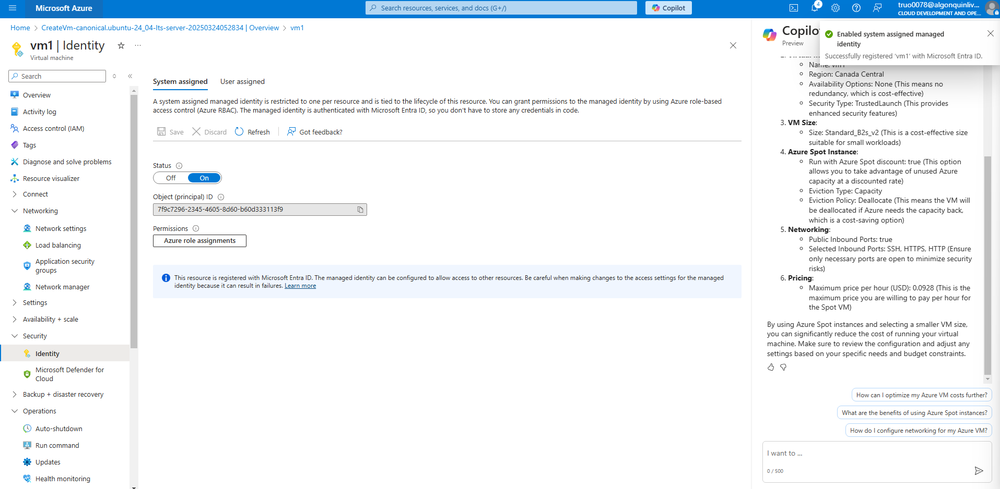
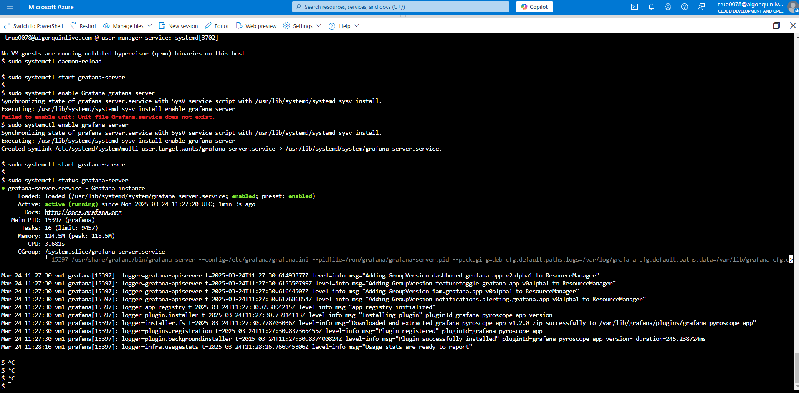
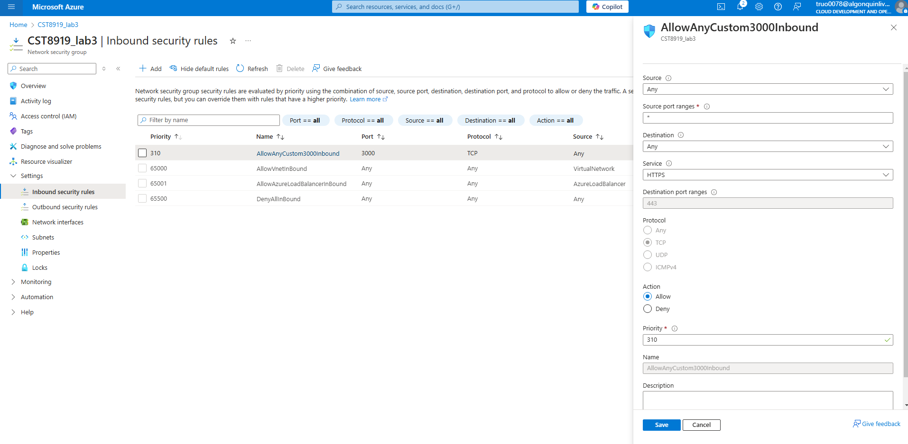
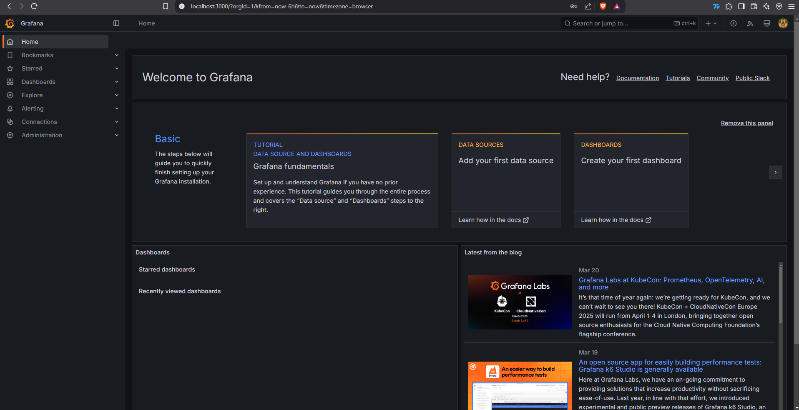
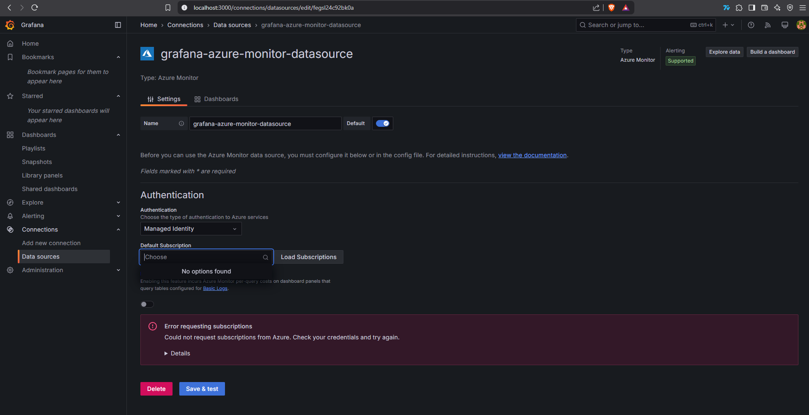

I created the VM with identity on

I have installed Grafana successfully

I created the Network Security Group

Grafana is running on browser

And I have logged in

I have changed the config file for managed_identity_enabled = true.
The subscription is not found

