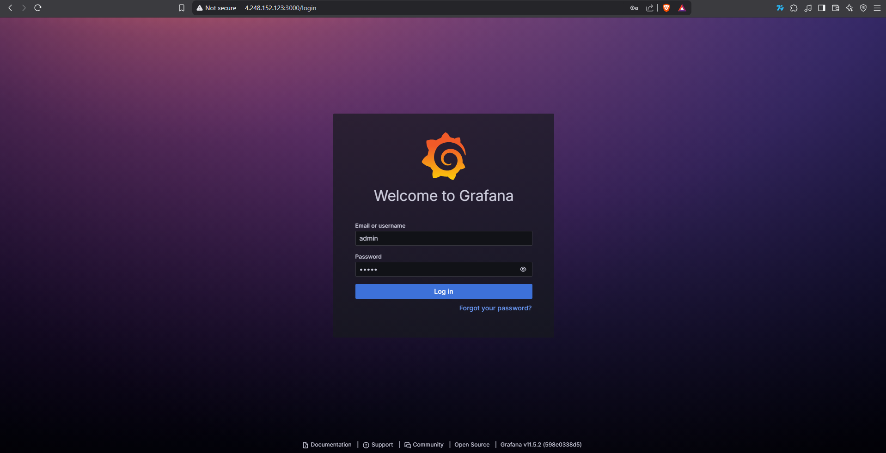

I created the VM with identity on

I have installed Grafana successfully

I created the Network Security Group

Grafana is running on browser

And I have logged in

I have changed the config file for managed_identity_enabled = true
The subscription is connected

I have created the dashboard and added CPU Percentage, Available Memory Percentage, Network In Total, Disk Read Bytes to the dashboard

